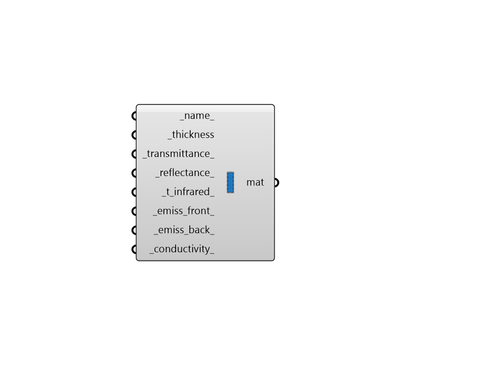

# Glass Material

 - [\[source code\]](https://github.com/ladybug-tools/honeybee-grasshopper-energy/blob/master/honeybee_grasshopper_energy/src//HB%20Glass%20Material.py)

Create a window material to describe a single glass pane corresponding to a layer in a window construction. This material can be plugged into the "HB Window Construction" component.

## Inputs

* **name**

  Text to set the name for the material and to be incorporated into a unique material identifier. 

* **thickness \[Required\]**

  Number for the thickness of the glass layer \[m\]. Typical values range from 0.003 meters \(3 mm\) to 0.012 meters \(12 mm\). 

* **transmittance**

  Number between 0 and 1 for the transmittance of both solar radiation and visible light through the glass at normal incidence. \(Default: 0.85 for clear uncoated glass\). 

* **reflectance**

  Number between 0 and 1 for the reflectance of both solar radiation and visible light off of the front side of the glass at normal incidence. \(Default: 0.075 for clear uncoated glass\). 

* **t\_infrared**

  Long-wave transmittance of the glass at normal incidence. \(Default: 0\). 

* **emiss\_front**

  Number between 0 and 1 for the infrared hemispherical emissivity of the front side of the glass. \(Defaul: 0.84, which is typical of clear glass\). 

* **emiss\_back**

  Number between 0 and 1 for the infrared hemispherical emissivity of the back side of the glass. \(Default: 0.84, which is typical of clear glass\). 

* **conductivity**

  Number for the thermal conductivity of the glass in W/m-K. \(Default: 0.9, whih is typical of clear glass\). 

## Outputs

* **mat**

  A window material that describes a single glass pane and can be assigned to a Honeybee Window construction. 

