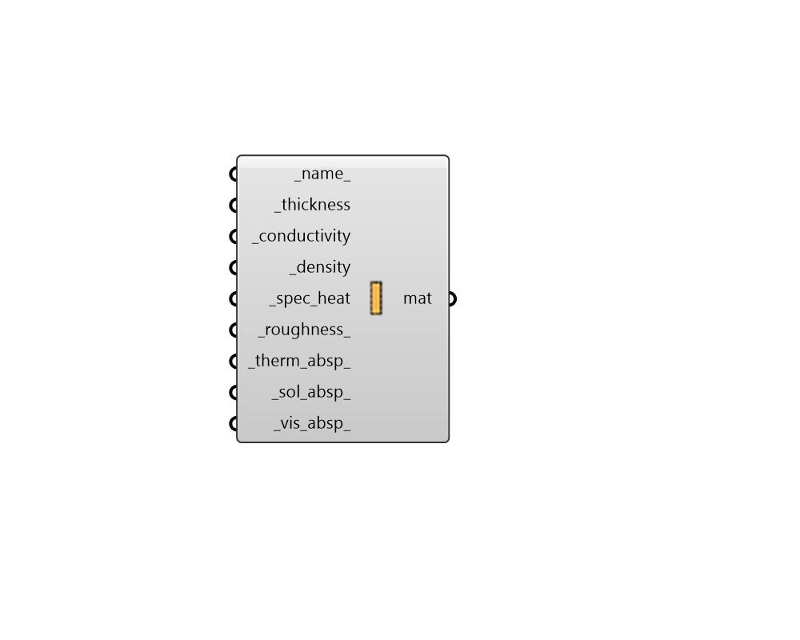

# Opaque Material

 - [\[source code\]](https://github.com/ladybug-tools/honeybee-grasshopper-energy/blob/master/honeybee_grasshopper_energy/src//HB%20Opaque%20Material.py)

Create a standard opaque material, which can be plugged into the "HB Opaque Construction" component.

## Inputs

* **name**

  Text to set the name for the material and to be incorporated into a unique material identifier. 

* **thickness \[Required\]**

  Number for the thickness of the material layer \[m\]. 

* **conductivity \[Required\]**

  Number for the thermal conductivity of the material \[W/m-K\]. 

* **density \[Required\]**

  Number for the density of the material \[kg/m3\]. 

* **spec\_heat \[Required\]**

  Number for the specific heat of the material \[J/kg-K\]. 

* **roughness**

  Text describing the relative roughness of the material. Must be one of the following: 'VeryRough', 'Rough', 'MediumRough', 'MediumSmooth', 'Smooth', 'VerySmooth'. \(Default: 'MediumRough'\). 

* **therm\_absp**

  A number between 0 and 1 for the fraction of incident long wavelength radiation that is absorbed by the material. \(Default: 0.9\). 

* **sol\_absp**

  A number between 0 and 1 for the fraction of incident solar radiation absorbed by the material. \(Default: 0.7\). 

* **vis\_absp**

  A number between 0 and 1 for the fraction of incident visible wavelength radiation absorbed by the material. Default value is the same as the _sol\_absp_. 

## Outputs

* **mat**

  A standard opaque material that can be assigned to a Honeybee Opaque construction. 

