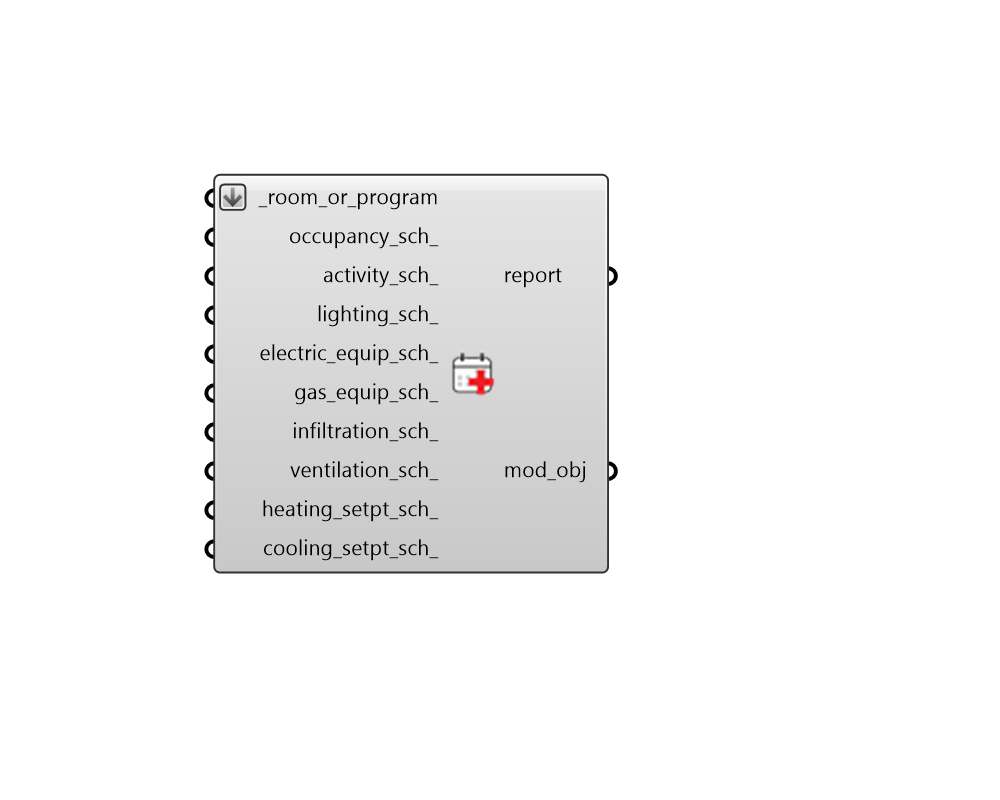

# Apply Room Schedules

 - [\[source code\]](https://github.com/ladybug-tools/honeybee-grasshopper-energy/blob/master/honeybee_grasshopper_energy/src//HB%20Apply%20Room%20Schedules.py)

Apply schedules to a Room or ProgramType.

Note that, if a schedule is assigned to a Room or ProgramType that posseses no value for a given load, an error will be raised. For example, assigning a gas_equip\_sch_ to a Room that has no GasEquipment object associated with it. This situation can be avoided by first passing the Rooms or ProgramTypes through the "HB Apply Load Values" component to eastablish a value for a given load.

## Inputs

* **room\_or\_program \[Required\]**

  Honeybee Rooms or Honeybee ProgramType objects for which schedules should be changed. This can also be the identifier of a ProgramType to be looked up in the program type library. 

* **occupancy\_sch**

  A fractional schedule for the occupancy over the course of the year. This can also be the identifier of a schedule to be looked up in the schedule library. 

* **activity\_sch**

  A schedule for the activity of the occupants over the course of the year. The type limt of this schedule should be "Power" and the values of the schedule equal to the number of Watts given off by an individual person in the room. If None, it will a default constant schedule with 120 Watts per person will be used, which is typical of awake, adult humans who are seated. 

* **lighting\_sch**

  A fractional for the use of lights over the course of the year. This can also be the identifier of a schedule to be looked up in the schedule library. 

* **electric\_equip\_sch**

  A fractional for the use of electric equipment over the course of the year. This can also be the identifier of a schedule to be looked up in the schedule library. 

* **gas\_equip\_sch**

  A fractional for the use of gas equipment over the course of the year. This can also be the identifier of a schedule to be looked up in the schedule library. 

* **infiltration\_sch**

  A fractional schedule for the infiltration over the course of the year. This can also be the identifier of a schedule to be looked up in the schedule library. 

* **ventilation\_sch**

  An optional fractional schedule for the ventilation over the course of the year. This can also be the identifier of a schedule to be looked up in the schedule library. The fractional values will get multiplied by the total design flow rate \(determined from the fields above and the calculation\_method\) to yield a complete ventilation profile. Setting this schedule to be the occupancy schedule of the zone will mimic demand controlled ventilation. 

* **heating\_setpt\_sch**

  A temperature schedule for the heating setpoint. This can also be a identifier of a schedule to be looked up in the schedule library. The type limit of this schedule should be temperature and the values should be the temperature setpoint in degrees Celcius. 

* **cooling\_setpt\_sch**

  A temperature schedule for the cooling setpoint. This can also be a identifier of a schedule to be looked up in the schedule library. The type limit of this schedule should be temperature and the values should be the temperature setpoint in degrees Celcius. 

## Outputs

* **report**

  Reports, errors, warnings, etc. 

* **mod\_obj**

  The input Rooms or ProgramTypes with their schedules modified. 

