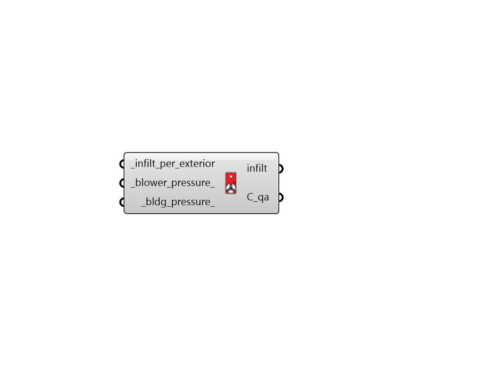

# Blower Pressure Converter

 - [\[source code\]](https://github.com/ladybug-tools/honeybee-grasshopper-energy/blob/master/honeybee_grasshopper_energy/src//HB%20Blower%20Pressure%20Converter.py)

Convert infiltration flow per exterior area measured at a particular blower door pressure to flow per exterior area measured at a typical building pressure.

This is accomplished by computing a normalized-area air mass flow coefficient that is derived the power law relationship between pressure and air flow. Cqa = Qblow / dPblow^n And then using the coefficient to approximate air flow at typical building pressure. Qbldg = Cqa \* dPbldg^n

where: Cqa: Air mass flow coefficient per unit meter at 1 Pa \[kg/m2/s/P^n\] Qblow: Blower-induced volumetric air flow rate per area \[m3/s/m2\] dPblow: Blower-induced change in pressure across building envelope orifice \[Pa\] Qbldg: Typical building volumetric air flow rate per area \[m3/s/m2\] dPbldg: Typical building change in pressure across building envelope orifice \[Pa\] d: Air density \[1.2041 kg/m3\] n: Air mass flow exponent \[0.65\]

## Inputs

* **infilt\_per\_exterior \[Required\]**

  A numerical value for the intensity of air flow induced by blower pressure in m3/s per square meter of exterior surface area. 

* **blower\_pressure**

  A number representing the pressure differential in Pascals \(Pa\) between indoors/outdoors at which the specified \_infilt\_per\_exterior occurs. Typical pressures induced by blower doors are 75 Pa and 50 Pa. \(Default: 75\). 

* **bldg\_pressure**

  The reference air pressure difference across building envelope under typical conditions in Pascals. \(Default: 4\). 

## Outputs

* **infilt**

  The intensity of infiltration in m3/s per square meter of exterior surface area at the input _bldg\_pressure_. 

* **C\_qa**

  Air mass flow coefficient per square meter at 1 Pa \[kg/m2/s/P^n\]. 

