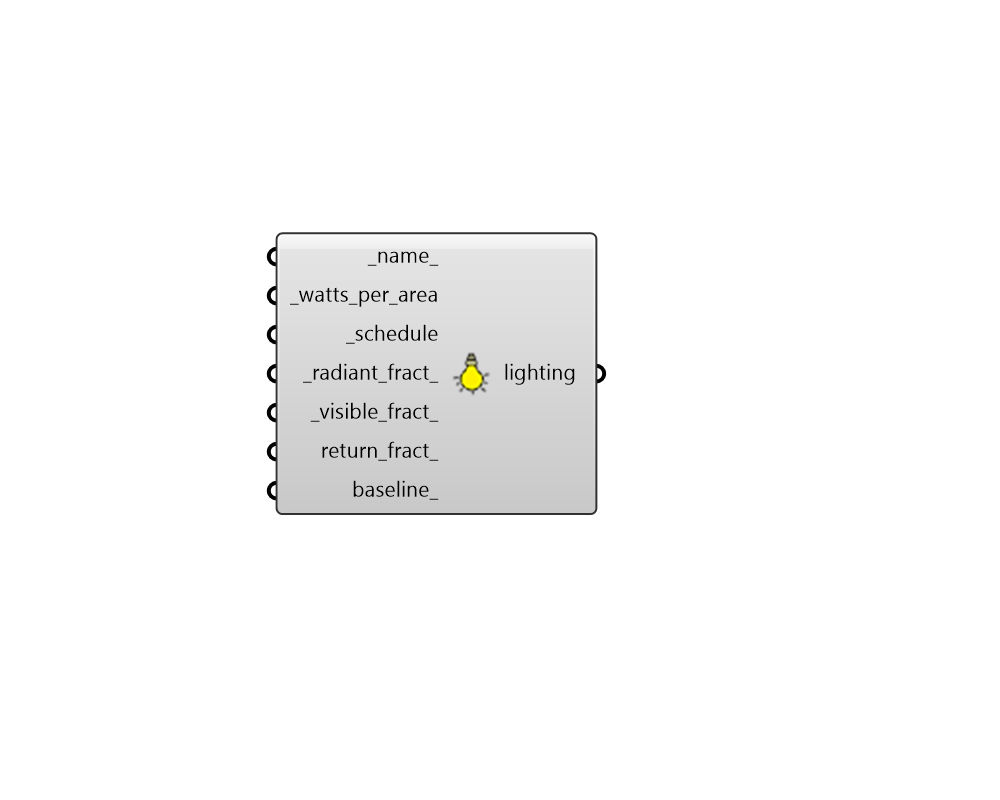

# Lighting

 - [\[source code\]](https://github.com/ladybug-tools/honeybee-grasshopper-energy/blob/master/honeybee_grasshopper_energy/src//HB%20Lighting.py)

Create a Lighting object that can be used to create a ProgramType or be assigned directly to a Room.

## Inputs

* **name**

  Text to set the name for the Lighting and to be incorporated into a unique Lighting identifier. If None, a unique name will be generated. 

* **watts\_per\_area \[Required\]**

  A numerical value for the lighting power density in Watts per square meter of floor area. 

* **schedule \[Required\]**

  A fractional for the use of lights over the course of the year. The fractional values will get multiplied by the \_watts\_per\_area to yield a complete lighting profile. 

* **radiant\_fract**

  A number between 0 and 1 for the fraction of the total lighting load given off as long wave radiant heat. 

* **visible\_fract**

  A number between 0 and 1 for the fraction of the total lighting load given off as short wave visible light. 

* **return\_fract**

  A number between 0 and 1 for the fraction of the total lighting load that goes into the zone return air \(into the zone outlet node\). Default: 0.0 \(representative of pendant lighting\). 

* **baseline**

  An optional number for the baseline lighting power density in W/m2 of floor area. This baseline is useful to track how much better the installed lights are in comparison to a standard like ASHRAE 90.1. If set to None, it will default to 11.84029 W/m2, which is that ASHRAE 90.1-2004 baseline for an office. 

## Outputs

* **lighting**

  A Lighting object that can be used to create a ProgramType or be assigned directly to a Room. 

