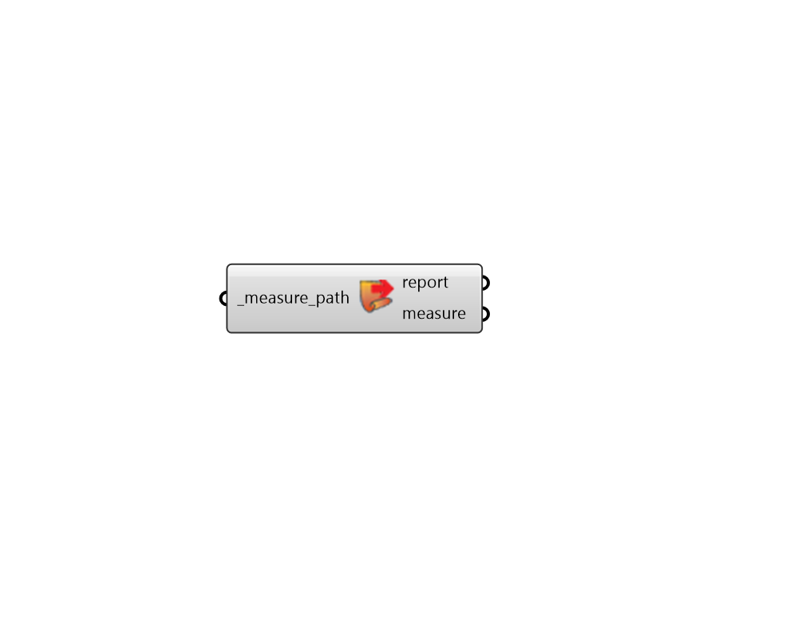

# Load Measure

 - [\[source code\]](https://github.com/ladybug-tools/honeybee-grasshopper-energy/blob/master/honeybee_grasshopper_energy/src//HB%20Load%20Measure.py)

Load OpenStudio measures into Grasshopper and assign the measure's input arguments. The resulting measure object can be plugged into the "measures\_" input of the "HB Model To OSM" component in order to be included in the export to OpenStudio.

Read more about OpenStudio measures and creating your own here: [http://nrel.github.io/OpenStudio-user-documentation/reference/measure\_writing\_guide/](http://nrel.github.io/OpenStudio-user-documentation/reference/measure_writing_guide/)

You can also download several measures created by others from here: [https://bcl.nrel.gov/nrel/types/measure](https://bcl.nrel.gov/nrel/types/measure)

## Inputs

* **measure\_path \[Required\]**

  Path to the folder in which the measure exists. This folder must contain a measure.rb and a measure.xml file. Note that connecting an input here will transform the component, essentially removing this input and changing all of the other component inputs to be input arguments for the measure. 

## Outputs

* **report**

  The execution information, as output and error streams 

* **measure**

  A measure measure object can be plugged into the "measures\_" input of the "HB Model To OSM" component in order to be included in the export to OpenStudio. 

