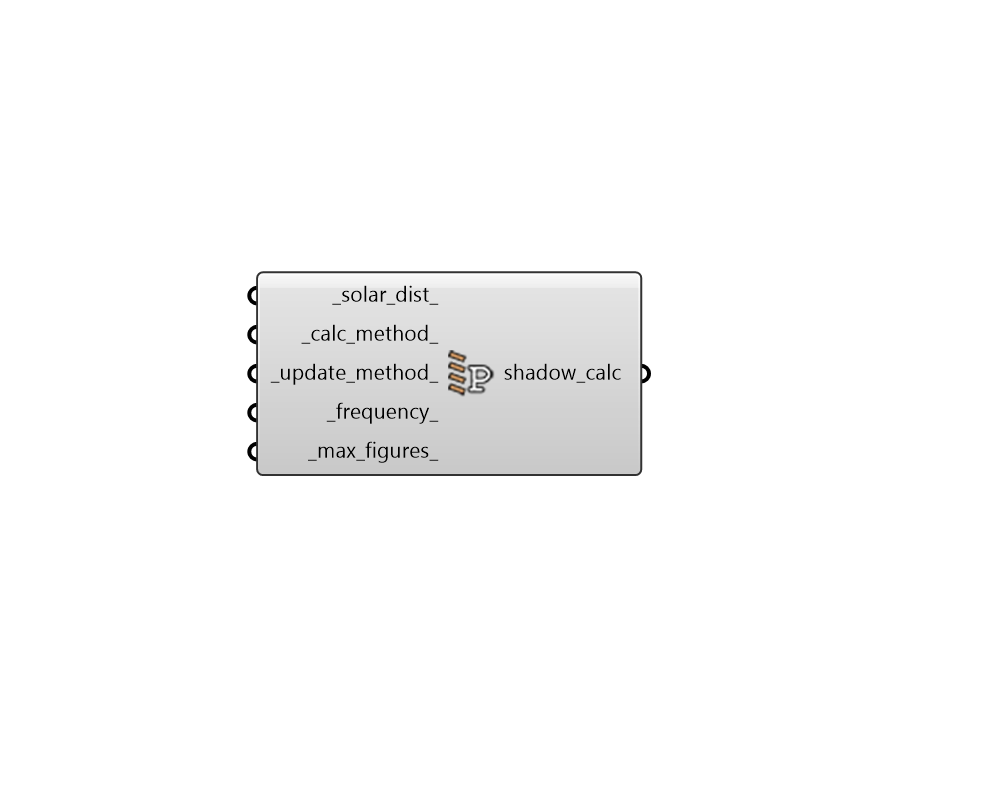

# Shadow Calculation

 - [\[source code\]](https://github.com/ladybug-tools/honeybee-grasshopper-energy/blob/master/honeybee_grasshopper_energy/src//HB%20Shadow%20Calculation.py)

Create settings for the EnergyPlus Shadow Calculation.

## Inputs

* **solar\_dist**

  An integer or text desribing how EnergyPlus should treat beam solar radiation and reflectances from surfaces that strike the building surfaces. Default is "FullExteriorWithReflections". Choose from the following.

  * 0 = "MinimalShadowing" - In this case, exterior shadowing is only computedfor windows and not for other opaque surfaces that might have their surface temperature affected by the sun. All beam solar radiation entering the zone is assumed to fall on the floor. A simple window view factor calculation will be used to distribute incoming diffuse solar energy between interior surfaces.
  * 1 = "FullExterior" - The simulation will perform the solar calculationin a manner that only accounts for direct sun and whether it is blocked by surrounding context geometry. For the inside of the building, all beam solar radiation entering the zone is assumed to fall on the floor. A simple window view factor calculation will be used to distribute incoming diffuse solar energy between interior surfaces.
  * 2 = "FullInteriorAndExterior" - The simulation will perform the solarcalculation in a manner that models the direct sun \(and wheter it is blocked by outdoor context goemetry. It will also ray trace the direct sun on the interior of zones to distribute it correctly between interior surfaces. Any indirect sun or sun bouncing off of objects will not be modled.
  * 3 = "FullExteriorWithReflections" - The simulation will perform thesolar calculation in a manner that accounts for both direct sun and the light bouncing off outdoor surrounding context. For the inside of the building, all beam solar radiation entering the zone is assumed to fall on the floor. A simple window view factor calculation will be used to distribute incoming diffuse solar energy between interior surfaces.
  * 4 = "FullInteriorAndExteriorWithReflections" - The simulation willperform the solar calculation in a manner that accounts for light bounces that happen both outside and inside the zones. This is the most accurate method and is the one assigned by default. Note that, if you use this method, EnergyPlus will give Severe warnings if your zones have concave geometry \(aka. are "L"-shaped\). Such geometries are not supported by this solar distribution calculation and it is recommeded that you either break up your zones in this case or not use this solar distribution method.

* **calc\_method**

  Text noting whether CPU-based polygon clipping method or GPU-based pixel counting method should be used. For low numbers of shading surfaces \(less than ~200\), PolygonClipping requires less runtime than PixelCounting. However, PixelCounting runtime scales significantly better at higher numbers of shading surfaces. PixelCounting also has no limitations related to zone concavity when used with any “FullInterior” solar distribution options. \(Default: PolygonClipping\). Choose from the following:

  * PolygonClipping
  * PixelCounting

* **update\_method**

  Text describing how often the solar and shading calculations are updated with respect to the flow of time in the simulation. \(Default: Periodic\) Choose from the following:

  * Periodic
  * Timestep

* **frequency**

  Integer for the number of days in each period in which a unique shadow calculation will be performed. This field is only used if the AverageOverDaysInFrequency method is used in the previous field. Default - 30. 

* **max\_figures**

  Integer for the number of figures used in shadow overlaps. Default - 15000. 

## Outputs

* **shadow\_calc**

  A ShadowCalculation object that can be connected to the "HB Simulation Parameter" component in order to specify settings for the EnergyPlus Shadow Calculation. 

