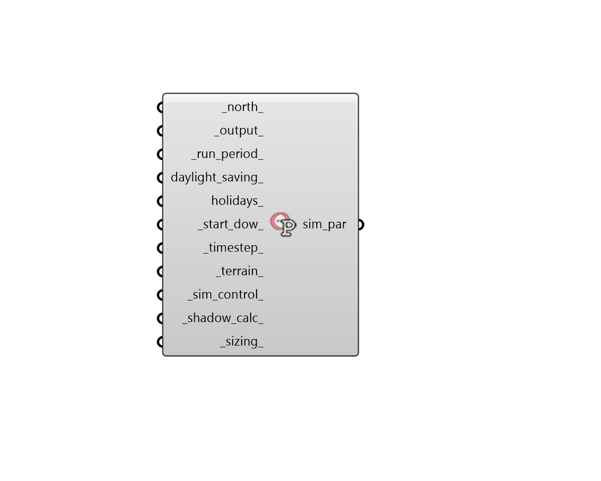

# Simulation Parameter

 - [\[source code\]](https://github.com/ladybug-tools/honeybee-grasshopper-energy/blob/master/honeybee_grasshopper_energy/src//HB%20Simulation%20Parameter.py)

Create a simulation parameter object that carries a complete set of EnergyPlus simulation settings and can be plugged into the "HB Model To OSM" component.

## Inputs

* **north**

  A number between -360 and 360 for the counterclockwise difference between the North and the positive Y-axis in degrees. 90 is West and 270 is East. Note that this is different than the convention used in EnergyPlus, which uses clockwise difference instead of counterclockwise difference. This can also be Vector for the direction to North. \(Default: 0\) 

* **output**

  A SimulationOutput that lists the desired outputs from the simulation and the format in which to report them. This can be created using the "HB Simulation Output" component. Default is to request zone energy use at an hourly timestep. 

* **run\_period**

  A ladybyg AnalysisPeriod object to describe the time period over which to run the simulation. the default is to run the simulation for the whole year. 

* **daylight\_saving**

  An optional ladybug AnalysisPeriod object to describe start and end of daylight savings time in the simulation. If None, no daylight savings time will be applied to the simulation. 

* **holidays**

  A list of Ladybug Date objects for the holidays within the simulation. These should be in the format of 'DD Month' \(eg. '1 Jan', '25 Dec'\). If None, no holidays are applied. Default: None. 

* **start\_dow**

  Text for the day of the week on which the simulation starts. Default: 'Sunday'. Choose from the following:

  * Sunday
  * Monday
  * Tuesday
  * Wednesday
  * Thursday
  * Friday
  * Saturday

* **timestep**

  An integer for the number of timesteps per hour at which the calculation will be run. Default: 6. The following values are acceptable: \(1, 2, 3, 4, 5, 6, 10, 12, 15, 20, 30, 60\) 

* **terrain**

  Text for the terrain type in which the model sits, used to determine the wind profile. Default: 'City'. Choose from:

  * Ocean
  * Country
  * Suburbs
  * Urban
  * City

* **sim\_control**

  A SimulationControl object that describes which types of calculations to run. This can be generated from the "HB Simulation Control" component. Default: perform a sizing calculation but only run the simulation for the RunPeriod. 

* **shadow\_calc**

  A ShadowCalculation object describing settings for the EnergyPlus Shadow Calculation. This can be generated from the "HB Shadow Calculation" component. Default: Average over 30 days with FullExteriorWithReflections. 

* **sizing**

  A SizingParameter object with criteria for sizing the heating and cooling system.  This can be generated from the "HB Sizing Parameter" component. 

## Outputs

* **sim\_par**

  A SimulationParameter object that can be connected to the "HB Model To IDF" component in order to specify EnergyPlus simulation settings 

