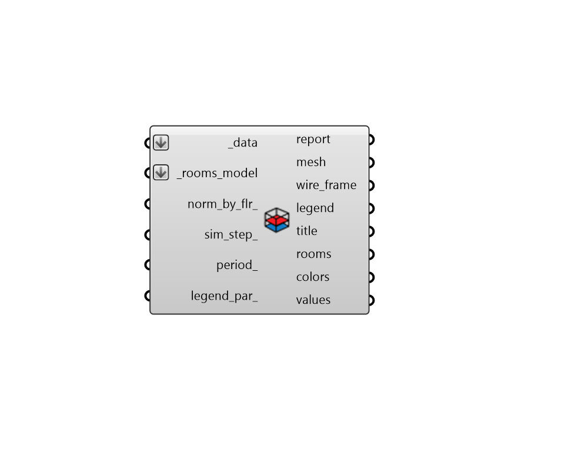

# Color Rooms

 - [\[source code\]](https://github.com/ladybug-tools/honeybee-grasshopper-energy/blob/master/honeybee_grasshopper_energy/src//HB%20Color%20Rooms.py)

Visualize Room-level energy simulation results as colored Room geometry.

## Inputs

* **data \[Required\]**

  A list of data collections of the same data type, which will be used to color Rooms. Data collections can be of any class \(eg. MonthlyCollection, DailyCollection\) but they should originate from an energy simulation sql \(with header metadata that has 'Zone' or, in some cases, 'System' keys\). These keys will be used to match the data in the collections to the input rooms. 

* **rooms\_model \[Required\]**

  An array of honeybee Rooms or honeybee Models, which will be matched to the data\_collections. The length of these Rooms does not have to match the data\_collections and this object will only create visualizations for rooms that are found to be matching. 

* **norm\_by\_flr**

  Boolean to note whether results should be normalized by the floor area of the Room if the data type of the data\_colections supports it. If False, values will be generated using sum total of the data collection values. Note that this input has no effect if the data type of the data\_collections is not cumulative since data collection values will always be averaged for this case. Default: True. 

* **sim\_step**

  An optional integer \(greater than or equal to 0\) to select a specific step of the data collections for which result values will be generated. If None, the geometry will be colored with the total of resutls in the data\_collections if the data type is cumulative or with the average of results if the data type is not cumulative. Default: None. 

* **period**

  A Ladybug analysis period to be applied to all of the input \_data. 

* **legend\_par**

  An optional LegendParameter object to change the display of the ColorRooms. 

## Outputs

* **report**

  ... 

* **mesh**

  A colored mesh of the Room floor geometry colored using the input \_data. Multiple meshes will be output for several data collections are input. 

* **wire\_frame**

  A list of polylines representing the outline of the room volumes. 

* **legend**

  Geometry representing the legend for the colored rooms. 

* **title**

  A text object for the global title. 

* **rooms**

  A list of honeybee Room objects that have been successfully matched to the input \_data. This can be plugged into the "HB Visualize Quick" component to get full room volumes that are colored. 

* **colors**

  A list of color objects that align with the output rooms. These can be connected to a native Grasshopper "Custom Preview" component in order to color room volumes with results. 

* **values**

  A list of numbers for each of the rooms, which are used to generate the colors. 

